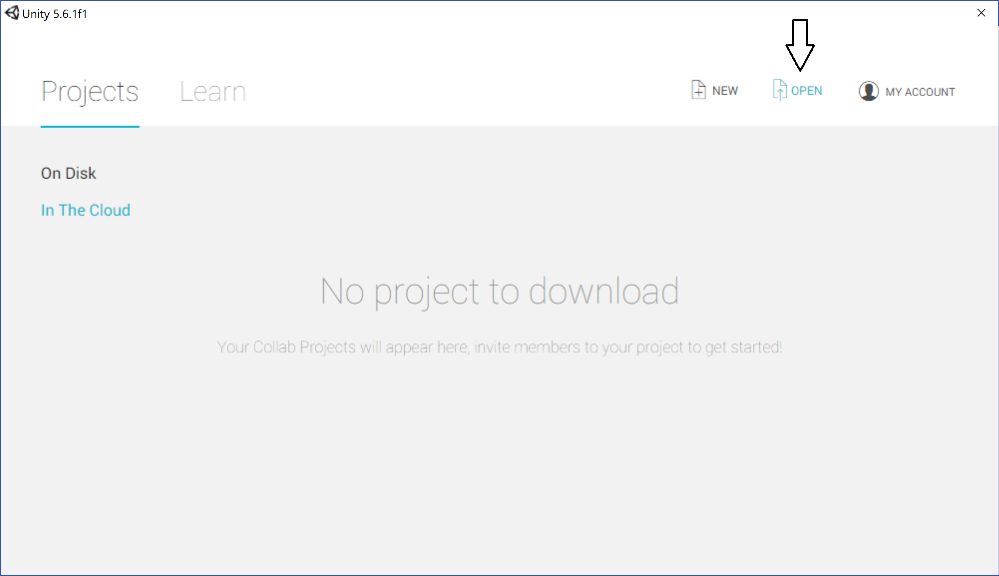
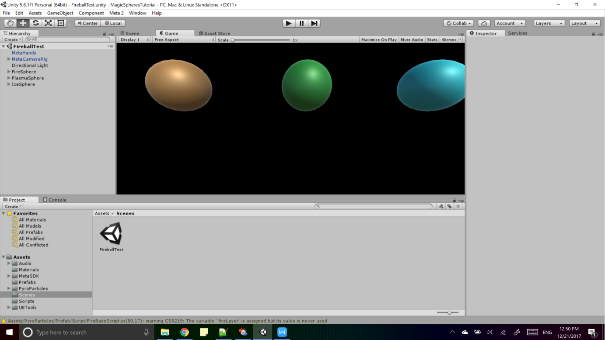
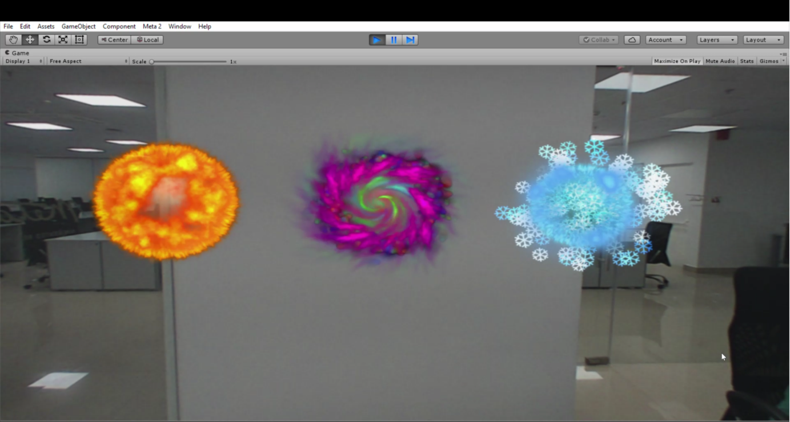
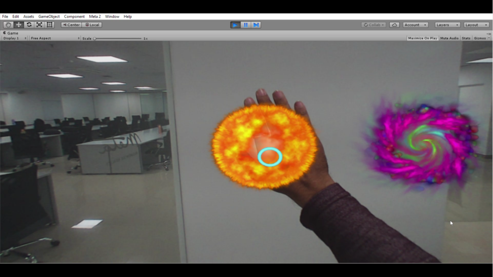
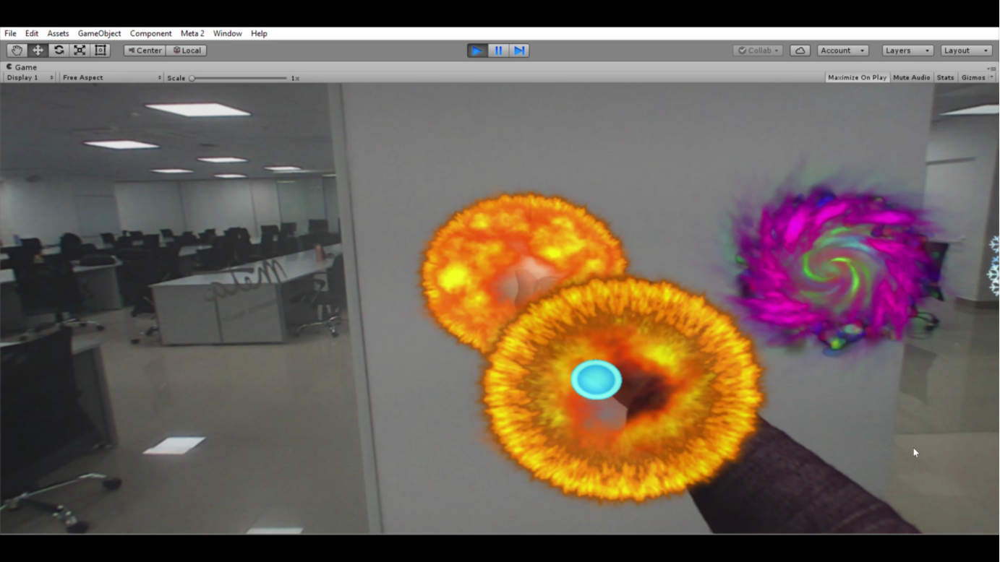
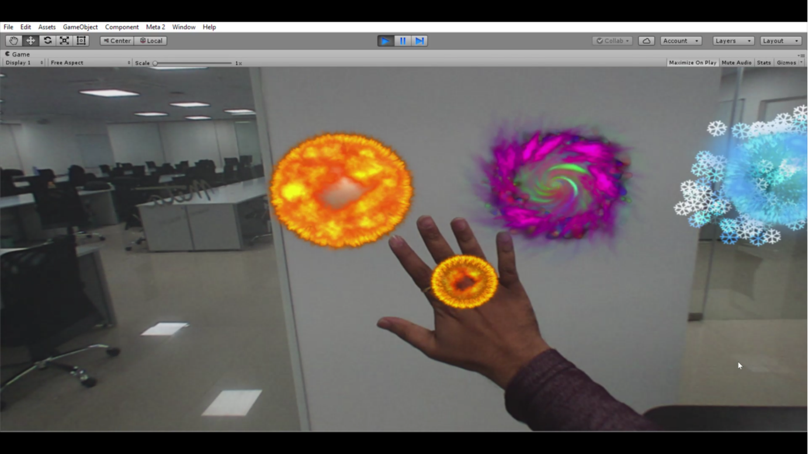
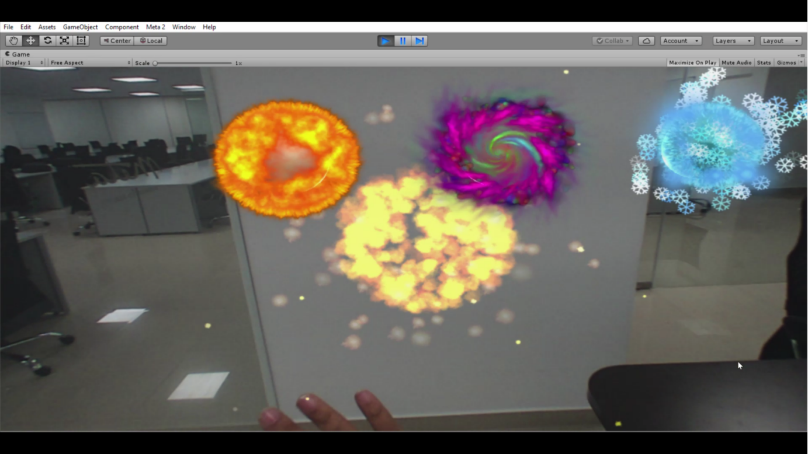

# magic_spheres_tutorial

## Introduction
This tutorial will walk through you on how to launch Meta Apps in Unity. This is a great way to get a feel for how virtual objects appear on the Meta 2 and how you can interact with them.

This tutorial is based on a recent [blog post](https://blog.metavision.com/extending-hand-interaction-grab-and-release). This includes a comprehensive video explaining the tutorial which we recommend checking out!

For Meta 2 SDK documentation, visit [docs.metavision.com](https://docs.metavision.com).

## Pre-requisites
1. Unity game engine. The preferred version is 5.6.0f3, but this tutorial will work in 2017.3.0f3 with warnings.
1. A PC which meets the [system requirements](https://buy.metavision.com/#specifications).
1. An installation of the Meta 2 SDK version 2.5.0 or 2.4.1. Click [here](https://devcenter.metavision.com/get-started/software-setup) for installation instructions.
1. A connected Meta 2. Click [here](https://devcenter.metavision.com/get-started/headset-setup) for more details on headset setup.
1. Visual Studio 2015 or later. This software is recommended for modifying the included C# scripts but is not necessary to run the tutorial project in Unity.

We recommend running the Hands Tutorial built-in to the Meta SDK (version 2.5.0 or later) before playing the tutorial scene so you are familiar with the best way to interact with the [Meta Hands system](https://docs.metavision.com/external/doc/latest/meta_hands.html).

## Steps to follow
1. Clone this repository. This current version is compatible with SDK versions 2.4.1 and 2.5.0. In the future, please select the branch which corresponds to your installed SDK version.

1. Open Unity and browse to the location where the repository has been downloaded. Once the project opens, **you will see errors** in the console regarding missing namespaces and classes of the MetaSDK.

1. In Unity's Project view, right-click, select *Import Package > Custom Package* and import the Meta Unity package. This is located within your Meta installation and by default can be found in *C:\Program Files\Meta\Meta SDK2 Beta\Unity*. You can also find it at `%META_SDK2%unity`.  

1. In Unity’s Project view, navigate to *Assets > Scenes* and double click *'FireballTest'* scene.  

1. The scene will be loaded In Hierarchy View and in the Game view you can see three spheres as seen below:

1. Put on the headset and Play the Unity scene.  

1. Follow the instructions on the headset screen for Environment Mapping. More information about it can be found in the [Tracking (SLAM)](https://docs.metavision.com/external/doc/latest/meta_slam) section.  

1. Once environment mapping is completed, you will see three spheres in the headset as seen below:
  

1. Place your hand just in front of any one of spheres (Objects) as below, and you can see a blue circle displayed near the back of your hand. This is Meta's hand indicator, and its presence confirms that the Meta headset has detected your hand is near an interactive object.
  

1. When the hand indicator is over the object, close your fist and note how the hand indicator changes indicating a successful grab. Now move your hand around slowly and observe the cloned object following your hand. Be sure to keep your hand within the Meta 2's depth sensor's field of view.
  

1. Open your hand and observe the object you held flying forward and exploding in a magically spectacular fashion!

Repeat the same steps for the remaining two spheres and enjoy the experience of Meta AR!

## How was this tutorial built?

Curious about how this tutorial was made? Read on. If you're looking for a general introduction to how to create a Meta application from scratch, see [here](https://docs.metavision.com/external/doc/latest/build_a_new_application.html).

The main SDK component in the scene is the [MetaCameraRig prefab](https://docs.metavision.com/external/doc/latest/meta_camera_rig.html). This provides rendering and headset tracking support.

The [MetaHands prefab](https://docs.metavision.com/external/doc/latest/meta_hands.html) provides hands tracking.

The rest of the experience is scripted within each of the "Sphere" objects. The `CloneGrab` script creates a clone of the sphere when the user grabs it. Each sphere also has a collider to allow the Hands system to detect it. Lastly, they also have the `ExplodeAfterDetach` component; let's just say that's where the magic truly happens!

## Updates
As we release future SDK versions, we'll update this tutorial as needed. Check back for updates in the future.

## Feedback
Questions, comments, or suggestions? Please visit our [forums](https://community.metavision.com/) to share your thoughts. We love to hear from you!
